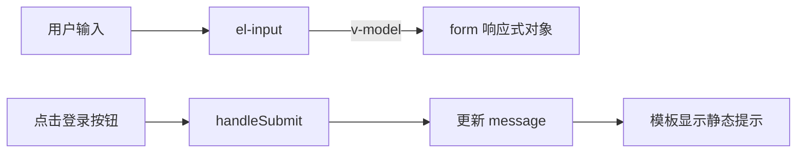

# 第 08 节学习资料：后台页面样式与 Element Plus

## 1. 学习目标

这份教材帮助你独立完成一个后台登录页的静态界面。读完后，你应当理解：

- 浏览器、Vue、CSS 和组件库分别负责什么；
- Element Plus 如何接入 Vue 项目；
- 如何组合表单组件，而不是把组件库当成完整页面模板；
- 如何使用 Flexbox、Grid、CSS 变量和媒体查询完成后台登录布局；
- BuildAdmin 的登录页为什么这样组织，以及初学阶段应该先学哪部分。

## 2. 前置知识

### 2.1 Vue 单文件组件

一个 `.vue` 文件通常由三部分组成：

```vue
<script setup lang="ts">
// 状态、函数和导入写在这里
</script>

<template>
  <!-- 页面结构写在这里 -->
</template>

<style scoped>
/* 当前组件的样式写在这里 */
</style>
```

`script` 决定页面“有什么数据、能做什么”，`template` 决定页面“有哪些元素”，`style` 决定页面“长什么样”。

### 2.2 响应式表单状态

登录表单有多个相关字段时，可以放进一个 `reactive` 对象：

```ts
import { reactive } from 'vue'

const form = reactive({
  username: '',
  password: '',
  remember: false,
})
```

模板中的 `v-model="form.username"` 建立双向绑定：输入框变化会更新对象，对象变化也会更新输入框。

### 2.3 块、Flexbox 与 Grid

普通块元素默认从上到下排列。Flexbox 适合处理一维排列与对齐，Grid 适合划分二维区域。

全屏居中的核心写法：

```css
.page {
  min-height: 100vh;
  display: flex;
  align-items: center;
  justify-content: center;
}
```

其中：

- `100vh` 表示视口高度的 100%；
- `justify-content` 控制主轴方向的对齐；
- `align-items` 控制交叉轴方向的对齐；
- 默认主轴是水平方向，因此两者组合实现水平和垂直居中。

## 3. 核心概念

### 3.1 四种技术的职责边界

| 技术 | 主要职责 | 登录页示例 |
| --- | --- | --- |
| HTML/模板 | 描述内容和层级 | 页面、标题、表单区域 |
| CSS/SCSS | 布局、颜色、间距、响应式 | 全屏居中、双栏、阴影、手机适配 |
| Vue | 管理数据和行为 | 表单状态、提示显示、点击事件 |
| Element Plus | 提供成熟 UI 控件 | 输入框、复选框、按钮、表单 |

组件库并不会知道你的品牌色是什么，也不知道登录卡片应该放在哪里。它只提供可复用控件。页面布局和产品风格仍需要自己决定。

### 3.2 全局注册 Element Plus

安装：

```bash
npm install element-plus @element-plus/icons-vue
```

入口文件接入：

```ts
import { createApp } from 'vue'
import ElementPlus from 'element-plus'
import 'element-plus/dist/index.css'
import App from './App.vue'

const app = createApp(App)
app.use(ElementPlus)
app.mount('#app')
```

`app.use(ElementPlus)` 注册组件；导入 CSS 才会获得组件库的默认外观。只做其中一步通常会出现“组件无法识别”或“组件没有正确样式”。

全局注册简单直观，适合本课程初期。大型项目还可以使用自动按需导入来减少构建体积，但那不是本节目标。

### 3.3 Element Plus 表单组件组合

最小组合如下：

```vue
<el-form :model="form">
  <el-form-item label="账号">
    <el-input v-model="form.username" placeholder="请输入账号" />
  </el-form-item>

  <el-form-item label="密码">
    <el-input v-model="form.password" type="password" show-password />
  </el-form-item>

  <el-checkbox v-model="form.remember">保持登录</el-checkbox>
  <el-button type="primary" @click="handleSubmit">登录</el-button>
</el-form>
```

这里的关键关系是：

- `el-form` 接收整个表单模型；
- `el-form-item` 是字段的布局和校验容器；
- `el-input` 通过 `v-model` 绑定具体字段；
- `type="password"` 隐藏密码字符；
- `show-password` 提供显示/隐藏密码的按钮；
- `el-button` 通过点击事件调用 Vue 函数。

本节只制作静态登录页，因此不配置 `rules`。真正的表单校验和登录逻辑放到第 16 节。

### 3.4 CSS 自定义属性

重复使用的颜色、尺寸可以定义为变量：

```css
.login-page {
  --page-bg: #eef3ff;
  --panel-bg: #ffffff;
  --brand-color: #315efb;
  --text-main: #182230;
  --text-muted: #667085;

  background: var(--page-bg);
  color: var(--text-main);
}
```

好处是：改主题时只需调整变量，组件内部不必搜索并替换许多颜色值。BuildAdmin 也大量使用 `--el-*` 与 `--ba-*` 变量维护组件库和业务主题。

### 3.5 `scoped` 样式

```vue
<style scoped>
.title { color: #182230; }
</style>
```

Vue 构建工具会为当前组件元素附加特殊属性，使选择器主要作用于当前组件，从而降低不同页面之间类名冲突的概率。

但 `scoped` 不是安全边界，也不是完全隔离的 Shadow DOM。修改子组件内部结构时通常需要 `:deep()`。例如：

```css
.login-form :deep(.el-input__wrapper) {
  border-radius: 10px;
}
```

不要大量依赖组件库内部类名，因为升级组件库后内部结构可能变化。能通过组件属性或公开 CSS 变量完成时，应优先使用公开方式。

### 3.6 响应式布局

桌面端可以显示品牌区和表单区，手机屏幕空间有限，可隐藏品牌区：

```css
.login-shell {
  display: grid;
  grid-template-columns: 1.1fr 0.9fr;
  width: min(960px, calc(100% - 48px));
}

@media (max-width: 720px) {
  .login-shell {
    display: block;
    width: min(100% - 32px, 420px);
  }

  .brand-panel {
    display: none;
  }
}
```

`width: min(...)` 会选择较小值：大屏时卡片不会无限变宽，小屏时也不会超出屏幕。媒体查询不是把桌面布局按比例缩小，而是在空间不足时改变布局策略。

## 4. BuildAdmin 源码拆解

### 4.1 入口处接入组件库

目标文件：`buildadmin/web/src/main.ts`。

其中的关键流程可以简化为：

```ts
import ElementPlus from 'element-plus'
import 'element-plus/dist/index.css'

const app = createApp(App)
app.use(ElementPlus)
app.mount('#app')
```

BuildAdmin 还加载了语言包、路由、Pinia、自定义指令、图标和全局 SCSS。这些体现了成熟项目的启动流程，但本节只关注 Element Plus 与全局样式。

### 4.2 登录页的结构

目标文件：`buildadmin/web/src/views/backend/login.vue`。

核心结构可以抽象为：

```text
页面
├── 语言切换器
├── 背景画布
└── 登录区域
    └── 登录卡片
        ├── 顶部图片
        └── 表单区域
            ├── 头像
            ├── 账号输入框
            ├── 密码输入框
            ├── 保持登录
            └── 登录按钮
```

注意它不是只使用 Element Plus。外层 `.login`、`.login-box`、`.head`、`.form` 和 `.content` 都是业务布局；输入框、表单和按钮才交给组件库。

### 4.3 样式策略

BuildAdmin 登录页使用了几种常见方法：

1. `.login` 绝对定位并铺满视口，然后用 Flexbox 居中。
2. `.login-box` 设置固定桌面宽度，形成稳定卡片。
3. 头像使用绝对定位，制造跨越头图和表单区的视觉效果。
4. `@media screen and (max-width: 720px)` 缩小移动端卡片。
5. `:deep()` 调整 Element Plus 子组件内部布局。
6. `@at-root .dark` 为暗色主题提供覆盖样式。

本节练习应学习这些“方法”，不要复制具体图片、颜色和所有代码。

### 4.4 本节暂不实现的内容

| 源码能力 | 后续课程 |
| --- | --- |
| 表单规则和校验 | 第 16 节 |
| 登录 API 和 Loading | 第 15、16、18 节 |
| 登录后路由跳转 | 第 09、17 节 |
| Pinia 用户状态 | 第 11、16 节 |
| 国际化 | 第 26 节 |
| 暗色主题 | 第 26 节 |
| 验证码 | 拓展内容 |

## 5. 完整示例与运行过程

以下示例用于完整说明知识点。你的作业可以参考结构，但应自行选择文案、颜色和类名。

### 5.1 `src/main.ts`

```ts
import { createApp } from 'vue'
import ElementPlus from 'element-plus'
import 'element-plus/dist/index.css'
import App from './App.vue'

const app = createApp(App)
app.use(ElementPlus)
app.mount('#app')
```

### 5.2 `src/views/login/LoginView.vue`

```vue
<script setup lang="ts">
import { reactive, ref } from 'vue'

const form = reactive({
  username: '',
  password: '',
  remember: false,
})

const message = ref('')

function handleSubmit() {
  message.value = '静态页面已完成，登录逻辑将在后续课程实现'
}
</script>

<template>
  <main class="login-page">
    <section class="login-shell">
      <div class="brand-panel">
        <p class="eyebrow">LEARNING PROJECT</p>
        <h1>轻量用户运营后台</h1>
        <p>从真实开源项目中学习后台前端架构，并亲手完成复刻。</p>
      </div>

      <div class="form-panel">
        <div class="form-heading">
          <h2>欢迎回来</h2>
          <p>请输入账号与密码进入管理后台</p>
        </div>

        <el-form class="login-form" :model="form" label-position="top" size="large">
          <el-form-item label="账号">
            <el-input v-model="form.username" placeholder="请输入账号" clearable />
          </el-form-item>

          <el-form-item label="密码">
            <el-input
              v-model="form.password"
              type="password"
              placeholder="请输入密码"
              show-password
            />
          </el-form-item>

          <div class="form-options">
            <el-checkbox v-model="form.remember">保持登录</el-checkbox>
            <span>忘记密码？</span>
          </div>

          <el-button class="submit-button" type="primary" @click="handleSubmit">
            登录
          </el-button>
        </el-form>

        <p v-if="message" class="result-message">{{ message }}</p>
      </div>
    </section>
  </main>
</template>

<style scoped>
.login-page {
  --page-bg-start: #edf3ff;
  --page-bg-end: #f7f9fc;
  --panel-bg: #ffffff;
  --brand-color: #315efb;
  --brand-color-dark: #2144c7;
  --text-main: #182230;
  --text-muted: #667085;
  --shell-shadow: 0 24px 70px rgba(31, 45, 78, 0.16);

  min-height: 100vh;
  display: flex;
  align-items: center;
  justify-content: center;
  box-sizing: border-box;
  padding: 24px;
  color: var(--text-main);
  background: linear-gradient(135deg, var(--page-bg-start), var(--page-bg-end));
}

.login-shell {
  display: grid;
  grid-template-columns: 1.1fr 0.9fr;
  width: min(960px, 100%);
  min-height: 560px;
  overflow: hidden;
  border-radius: 24px;
  background: var(--panel-bg);
  box-shadow: var(--shell-shadow);
}

.brand-panel {
  display: flex;
  flex-direction: column;
  justify-content: center;
  padding: 64px;
  color: #ffffff;
  background: linear-gradient(145deg, var(--brand-color), var(--brand-color-dark));
}

.brand-panel h1 {
  margin: 10px 0 18px;
  font-size: clamp(32px, 4vw, 52px);
  line-height: 1.15;
}

.brand-panel p {
  line-height: 1.8;
}

.eyebrow {
  margin: 0;
  font-size: 12px;
  letter-spacing: 0.18em;
}

.form-panel {
  display: flex;
  flex-direction: column;
  justify-content: center;
  padding: 56px;
}

.form-heading h2 {
  margin: 0;
  font-size: 30px;
}

.form-heading p {
  margin: 10px 0 32px;
  color: var(--text-muted);
}

.form-options {
  display: flex;
  align-items: center;
  justify-content: space-between;
  margin: -4px 0 22px;
  color: var(--text-muted);
  font-size: 14px;
}

.submit-button {
  width: 100%;
}

.result-message {
  margin: 18px 0 0;
  color: var(--brand-color);
  text-align: center;
}

@media (max-width: 720px) {
  .login-page {
    padding: 16px;
  }

  .login-shell {
    display: block;
    width: min(420px, 100%);
    min-height: auto;
  }

  .brand-panel {
    display: none;
  }

  .form-panel {
    padding: 36px 24px;
  }
}
</style>
```

### 5.3 `src/App.vue`

```vue
<script setup lang="ts">
import LoginView from './views/login/LoginView.vue'
</script>

<template>
  <LoginView />
</template>
```

### 5.4 运行过程

1. `npm install` 根据 `package.json` 安装依赖。
2. `npm run dev` 启动 Vite 开发服务器。
3. 浏览器请求首页，Vite 从 `main.ts` 开始加载模块。
4. `main.ts` 创建 Vue 应用、注册 Element Plus 并挂载 `App.vue`。
5. `App.vue` 渲染 `LoginView.vue`。
6. Element Plus 负责渲染输入框、复选框和按钮；组件内 CSS 负责整体布局。
7. 用户输入时，`v-model` 更新 `form`。
8. 点击登录按钮后，`handleSubmit` 更新 `message`，Vue 重新渲染提示文字。

数据流如下：



## 6. 常见错误

### 错误一：组件有结构但没有样式

原因通常是忘记导入：

```ts
import 'element-plus/dist/index.css'
```

### 错误二：Vue 警告无法解析 `el-button`

如果采用全局注册方式，检查是否在挂载前调用：

```ts
app.use(ElementPlus)
```

### 错误三：页面出现横向滚动条

常见原因是元素使用 `width: 100vw` 后又添加左右 padding。可在容器上使用 `box-sizing: border-box`，或者用 `width: 100%` 配合父级尺寸。

### 错误四：手机上卡片超出屏幕

不要只写固定宽度 `width: 960px`。可以写：

```css
width: min(960px, 100%);
```

并在媒体查询中改变双栏结构。

### 错误五：`scoped` 样式改不到组件库内部

Element Plus 是子组件，其内部元素不直接带当前组件的 scoped 属性。确有必要时使用 `:deep()`，但应控制范围。

### 错误六：本节提前写完整登录功能

真实登录涉及表单校验、请求层、token、用户状态、路由和错误处理。现在混在一起，会很难判断错误来自布局还是业务。先完成静态界面是有意的分层练习。

## 7. 自测题

1. 为什么 Element Plus 既要注册 JavaScript 插件，又要引入 CSS？
2. 登录卡片全屏居中至少需要哪三个关键 CSS 声明？
3. `el-form` 的 `:model="form"` 与 `el-input` 的 `v-model="form.username"` 各自绑定什么？
4. `scoped` 样式的主要价值是什么？
5. 为什么不建议大量覆盖 `.el-input__wrapper` 这类内部类？
6. `width: min(960px, 100%)` 在大屏和小屏上分别会怎样？
7. 响应式设计为什么不等于把桌面页面整体缩小？
8. BuildAdmin 登录页中，哪些内容属于本节范围？至少列出 4 项。

## 8. 参考答案

1. 插件注册让 Vue 认识并能渲染组件，CSS 提供组件默认视觉样式；缺一会导致组件不可用或外观异常。
2. 父容器使用 `display: flex`、`align-items: center`、`justify-content: center`，并给父容器足够高度，如 `min-height: 100vh`。
3. `:model` 把整个表单数据对象交给表单容器；输入框的 `v-model` 绑定并修改其中一个具体字段。
4. 降低当前组件样式意外影响其他页面的概率，减少常见类名冲突。
5. 它们属于组件库实现细节，升级后可能改变；大量覆盖还会提高维护成本。应优先使用组件属性和公开 CSS 变量。
6. 大屏最大为 960px；可用宽度不足 960px 时采用 100%，从而不超出父容器。
7. 小屏空间和交互方式不同，常常需要隐藏次要内容、改为单栏并调整间距，而不仅是等比缩放。
8. 全屏背景、居中卡片、表单结构、输入框、复选框、按钮、基础配色和窄屏适配属于本节范围；请求、验证码、国际化和暗色主题暂不实现。
