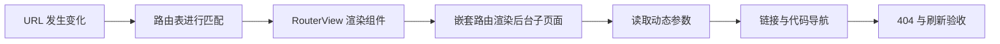

# 第 09 节：Vue Router 基础

## 1. 课程信息

| 项目 | 内容 |
| --- | --- |
| 节次 | 第 09 节 |
| 课程主题 | Vue Router 基础 |
| 当前状态 | 🟩 已完成 |
| 建议时长 | 2～3 小时 |
| 源码观察对象 | `buildadmin/web/src/router/index.ts`、`buildadmin/web/src/router/static.ts`、`buildadmin/web/src/App.vue` |
| 本节实践目录 | `F:\project\MyProject\ba-learn` |
| 本节产物 | 登录页、后台首页、用户详情页组成的可导航路由 |

## 2. 本节目标

完成本节后，你应当能够：

1. 用自己的话解释单页应用为什么仍然需要“路由”。
2. 说清路由表、URL、页面组件和 `<RouterView>` 的关系。
3. 配置普通路由、嵌套路由、动态参数和 404 路由。
4. 正确选择 `<RouterLink>` 与 `router.push()` 进行导航。
5. 使用 `useRoute()` 读取当前路由参数，使用 `useRouter()` 发起跳转。
6. 解释 BuildAdmin 为什么让登录页独立于后台布局。

## 3. 开课诊断

先不要查资料，请在聊天中用简短的话回答下面 4 题。答案不计分，Coach 会根据你的回答调整今天的讲解：

1. 当用户访问 `/users/8` 时，你认为 Vue Router 至少需要知道哪两件事，才能显示正确页面？
2. `<RouterView>` 在页面中扮演什么角色？如果 `App.vue` 没有它，会发生什么？
3. “点击导航链接”与“直接修改 `window.location.href`”对单页应用有什么可能的区别？不确定也可以写出猜测。
4. 后台的登录页为什么通常不应该放在带侧栏、头部的后台布局里面？

## 4. 学习路线



今天按下面顺序推进：

1. 回答开课诊断。
2. 阅读 `第09节-学习资料.md` 的第 1～4 节，先建立路由地图。
3. 跟随 Coach 做两个口头判断题，确认 `route` 与 `router`、父路由与子路由的区别。
4. 阅读教材的完整示例与运行过程。
5. 按动手任务改造自己的项目；不要直接复制 BuildAdmin 的复杂路由。
6. 运行并逐项检查导航、参数、刷新和 404。
7. 把完成情况告诉 Coach，由 Coach 检查代码并进行核心验收。

## 5. Coach 引导与学生回答

### 引导一：先抓住路由的四个角色

| 角色 | 本节中的例子 | 作用 |
| --- | --- | --- |
| 地址 | `/login`、`/admin`、`/admin/users/8` | 表示用户当前所在位置 |
| 路由记录 | `{ path, component, children }` | 规定地址应该匹配什么组件 |
| 路由出口 | `<RouterView />` | 决定匹配组件渲染到哪里 |
| 导航方式 | `<RouterLink>`、`router.push()` | 在不整页刷新的情况下改变位置 |

先记住一句话：**路由表负责匹配，RouterView 负责摆放，导航负责改变地址。**

### 引导二：理解后台的两层出口

本节后台页面使用嵌套路由：

```text
App.vue 的 RouterView
├── /login -> LoginView
└── /admin -> AdminLayout
               └── AdminLayout 的 RouterView
                   ├── /admin/home -> HomeView
                   └── /admin/users/:id -> UserDetailView
```

`App.vue` 的出口决定显示“登录页还是后台布局”；`AdminLayout.vue` 的出口决定后台内容区显示“首页还是用户详情”。父路由若没有第二个 `<RouterView>`，子路由即使匹配成功也没有渲染位置。

### 开课诊断记录（2026-08-27）

| 题目 | 学生回答 | Coach 反馈 |
| --- | --- | --- |
| `/users/8` 显示页面所需信息 | 路径、组件 | 方向正确。更完整地说，Router 需要当前 URL，以及路由表中“路径规则与组件”的对应关系；`8` 还会被解析为动态参数。 |
| `<RouterView>` 的职责 | 把 URL 中的 path 映射到对应组件；没有它只能显示 App.vue 中的固定组件 | 后半句正确。需要修正职责边界：路由表负责匹配 URL 和组件，RouterView 只提供匹配组件的渲染位置。 |
| Router 导航与 `window.location.href` 的区别 | 不知道 | 这是今天需要补齐的重点。Router 内部导航通常不重新加载整份应用；修改 `location.href` 通常触发浏览器重新请求并初始化整个页面。 |
| 登录页为何独立于后台布局 | 登录页是独立页面；放进后台布局会同时显示侧边栏和头部 | 正确，已经理解路由层级应该与界面层级一致。 |

诊断结论：学生已理解路径、组件、出口和布局层级的基本关系。后续不重复讲解 SPA 基础，重点补强“路由表与 RouterView 的职责边界”、客户端导航，以及父子 RouterView 的渲染关系。

### 概念判断记录（2026-08-27）

| 题目 | 学生回答 | Coach 反馈 |
| --- | --- | --- |
| `AdminLayout.vue` 是否还需要 RouterView | 需要；App 中是应用一级页面，如 404、前台、登录，AdminLayout 中是后台一级页面，如用户管理、日志管理 | 正确。更准确地说，App 的出口渲染顶层匹配组件，AdminLayout 的出口渲染 `/admin` 的子路由组件。 |
| 代码逻辑触发详情跳转应选什么 | 不知道 | 应优先使用 `router.push()`。RouterLink 适合模板中语义明确的链接；事件处理函数根据业务逻辑决定跳转时使用 Router 实例。 |

### 顶层路由实践记录（2026-08-27）

| 检查项 | 结果 | Coach 反馈 |
| --- | --- | --- |
| App 顶层出口 | 通过 | `App.vue` 已移除固定页面，只保留 RouterView。 |
| `/` 重定向 | 通过 | 根地址重定向到 `/login`。 |
| 登录页路由 | 通过 | 使用动态导入加载现有登录页。 |
| 404 通配路由 | 修正后通过 | 初次遗漏参数冒号，已从 `/pathMatch(.*)*` 修正为 `/:pathMatch(.*)*`，实际访问未知地址可显示 404。 |
| 404 返回链接 | 修正后通过 | RouterLink 已补充可见链接文字。 |
| 类型检查 | 通过 | 顶层路由阶段未发现 TypeScript 错误。 |

### 嵌套路由与导航实践记录（2026-08-27）

| 检查项 | 结果 | Coach 反馈 |
| --- | --- | --- |
| 后台父子路由 | 通过 | `/admin` 使用 AdminLayout，空子路径重定向到 `/admin/home`。 |
| 两层 RouterView | 通过 | 后台首页和用户详情均渲染在 AdminLayout 的内容出口中。 |
| 动态参数 | 修正后通过 | 子路径去除前导 `/` 后正确组合为 `/admin/users/:id`；详情页直接读取响应式 `route.params.id`。 |
| 声明式导航 | 通过 | 后台首页、详情返回等链接使用 RouterLink。 |
| 编程式导航 | 修正后通过 | 首页详情按钮和登录按钮使用 Router 实例的 `push()`。期间通过类型错误进一步区分了 `useRoute()` 与 `useRouter()`。 |
| CSS 构建错误 | 修正后通过 | 普通 CSS 中的 `//` 注释已删除，改正了 CSS 注释语法问题。 |
| 类型检查与生产构建 | 通过 | `npm run build` 成功；仅有不阻断本节的包体积警告。 |

### 最终理解验收记录（2026-08-27）

| 题目 | 学生回答 | Coach 反馈 |
| --- | --- | --- |
| `useRoute()` 与 `useRouter()` | 获取路由信息；获取路由器，用于跳转页面、导航守卫等 | 基本通过。前者是当前路由位置对象，后者是整个 Router 实例。 |
| App 与 AdminLayout 为何都需要 RouterView | 不懂 | 待补强。需要理解一条嵌套 URL 会同时匹配父路由和子路由，每一层匹配组件都需要对应层级的出口。 |

补强回答：学生能够说明 App 的出口承载“顶层页面或布局”，AdminLayout 的出口承载“后台布局内部的业务页面”。代入 `/admin/users/8`，前者显示 AdminLayout，后者显示 UserDetailView。两层出口知识点通过。

## 6. 动手任务（明确目录和文件名）

在 `F:\project\MyProject\ba-learn` 中完成以下改造。

### 任务一：把根组件改成路由出口

修改：`src/App.vue`

- 删除固定导入和固定渲染的 `LoginView`。
- 使用 `<RouterView />` 承接当前路由组件。
- 根组件不承担具体页面业务。

### 任务二：建立后台布局

新建：`src/layouts/AdminLayout.vue`

- 至少包含一个清楚的后台标题或 Logo 区。
- 使用 `<RouterLink>` 提供“首页”导航。
- 保留一个 `<RouterView />` 作为后台子页面出口。
- 本节不要求完成最终侧栏样式，第 12～13 节会正式实现布局与菜单。

### 任务三：建立两个页面

新建：

- `src/views/home/HomeView.vue`
- `src/views/user/UserDetailView.vue`

要求：

- 首页能看出当前是后台首页。
- 首页提供一个按钮，点击后用 `router.push()` 前往用户 8 的详情页。
- 用户详情页使用 `useRoute()` 显示 URL 中的用户 ID。
- 用户详情页提供返回首页的导航。

### 任务四：配置路由表

修改：`src/router/index.ts`

至少配置：

- `/` 重定向到 `/login`；
- `/login` 显示现有 `LoginView.vue`；
- `/admin` 使用 `AdminLayout.vue`；
- `/admin` 的默认子路由重定向到 `/admin/home`；
- `/admin/home` 显示后台首页；
- `/admin/users/:id` 显示用户详情；
- 未匹配地址显示一个简单 404 页面，或重定向到你新建的 404 页面。

新建 404 页面时使用：`src/views/error/NotFoundView.vue`。

### 任务五：让登录页按钮进入后台

修改：`src/views/login/LoginView.vue`

- 保留第 08 节已有布局与响应式样式。
- 点击登录按钮后，使用 `router.push('/admin/home')` 进入后台首页。
- 本节只练导航，不做账号校验、token 或真实登录；这些属于第 16～17 节。

完成后运行项目，并告诉 Coach：“第 09 节代码已完成”。Coach 将读取代码并反馈。若页面效果存在疑问，可附桌面截图。

## 7. 本节输出

本节以实际代码与过程问答为主，不布置长篇报告。请准备展示下面 4 个结果：

1. 从 `/login` 点击按钮能到 `/admin/home`。
2. 从首页点击按钮能到 `/admin/users/8`，页面显示 ID `8`。
3. 在用户详情地址按浏览器刷新后，仍显示同一个用户详情页。
4. 输入一个不存在的地址，能进入 404 页面。

验收时另回答两个核心问题：

- `useRoute()` 与 `useRouter()` 分别解决什么问题？
- 为什么 `AdminLayout.vue` 还要再放一个 `<RouterView>`？

## 8. 验收标准

| 检查项 | 通过条件 |
| --- | --- |
| 基础路由 | 登录、后台首页、用户详情三个页面均能通过 URL 正确访问 |
| 嵌套路由 | 后台子页面渲染在 `AdminLayout` 内容区内 |
| 参数 | `/admin/users/:id` 能读取并显示不同 ID |
| 导航 | 至少分别正确使用一次 `<RouterLink>` 和 `router.push()` |
| 默认入口 | `/` 与 `/admin` 都有明确的重定向结果 |
| 异常地址 | 未知地址得到 404 页面，而不是空白页 |
| 刷新 | 在具体页面刷新后路由仍正确；开发服务器下不出现 404 |
| 工程检查 | TypeScript 类型检查和生产构建通过 |
| 理解 | 能解释两个 RouterView、route/router 的职责区别 |

## 9. 学习小结

本节结束时应形成这条主线：URL 变化后，Vue Router 用路由表进行匹配，把组件放入最近一层 RouterView；父子路由对应父子出口；动态参数属于当前路由信息；Router 实例负责发起导航。

学习完成后，由 Coach 根据代码和问答补充你的掌握情况。

## 10. 进度更新

| 项目 | 当前记录 |
| --- | --- |
| 开始日期 | 2026-08-27 |
| 当前状态 | 🟩 已完成 |
| 已完成步骤 | 课程资料、诊断、顶层与嵌套路由、动态参数、两种导航、404、类型检查与生产构建 |
| 待完成步骤 | 无 |
| 下一动作 | 开始第 10 节：BuildAdmin 路由与动态页面 |
