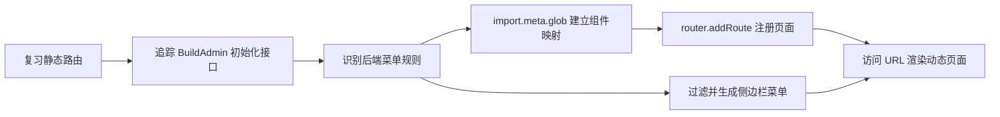

# 第 10 节：BuildAdmin 路由与动态页面

## 1. 课程信息

| 项目 | 内容 |
| --- | --- |
| 节次 | 第 10 节 |
| 课程主题 | BuildAdmin 路由与动态页面 |
| 当前状态 | 🟩 已完成 |
| 建议时长 | 2～3 小时 |
| 源码观察对象 | `buildadmin/web/src/layouts/backend/index.vue`、`buildadmin/web/src/utils/router.ts`、`buildadmin/web/src/router/static/adminBase.ts` |
| 本节实践目录 | `F:\project\MyProject\ba-learn` |
| 本节产物 | 模拟菜单数据和可运行的简化动态路由实现 |

## 2. 本节目标

完成本节后，你应当能够：

1. 区分静态路由、动态路由和动态导入。
2. 解释 BuildAdmin 为什么由后端返回菜单规则，而不是把所有业务路由写死在前端。
3. 说清 `import.meta.glob()`、组件路径和懒加载函数之间的关系。
4. 使用 `router.addRoute()` 把业务页面挂到现有 `admin` 父路由下。
5. 理解“菜单树”和“路由表”来自同一份规则数据，但用途并不相同。
6. 能讲清 BuildAdmin 从初始化接口到页面呈现的关键流程。

## 3. 开课诊断

先不要查教材，请在聊天中简短回答下面 4 题。答错没有关系，Coach 会根据答案决定讲解深度：

1. 如果后端返回 `{ path: 'reports', component: '/src/views/admin/ReportView.vue' }`，浏览器能直接渲染这个字符串指向的 Vue 文件吗？为什么？
2. `() => import('@/views/home/HomeView.vue')` 和 `router.addRoute()` 分别解决什么问题？
3. 假设“用户管理”出现在侧边栏中，但没有注册成 Vue Router 路由，点击后可能发生什么？
4. 你认为菜单和路由是一回事吗？请说出一个相同点或不同点。

## 4. 学习路线



今天按以下顺序推进：

1. 回答开课诊断。
2. 阅读学习资料第 1～4 节，建立动态路由全貌。
3. 对照 BuildAdmin 三个关键文件，追踪真实调用链。
4. 完成两个口头判断，区分动态导入与动态注册、菜单树与路由表。
5. 按指定文件完成简化实现。
6. 验证动态页面、未知组件和重复初始化。
7. 提交完成情况，由 Coach 检查代码并进行核心验收。

## 5. Coach 引导与学生回答

### 引导一：先分清三个“动态”概念

| 概念 | 发生了什么 | 本节例子 |
| --- | --- | --- |
| 动态路由参数 | 路由已存在，URL 中某一段可变化 | `/admin/users/:id` |
| 动态导入 | 页面代码在需要时才加载 | `() => import('...vue')` |
| 动态注册路由 | 应用运行后才把路由记录加入 Router | `router.addRoute('admin', route)` |

第 09 节的 `users/:id` 是动态参数，但路由记录仍然在启动时写死。今天的目标是让一份运行时菜单数据决定注册哪些业务页面。

### 引导二：BuildAdmin 的一份数据有三条去路

后端返回的规则树不是简单地原样交给 Router：

```text
res.data.menus
├── 页面规则（menu_type=tab） -> 注册为 Vue Router 路由
├── 菜单/目录（type=menu/menu_dir） -> 生成侧边栏菜单树
└── 按钮规则（type=button） -> 生成按钮权限节点
```

本节只亲手实现前两条的最小版本；按钮权限留到第 25 节。

### 引导三：真实源码调用链

1. `layouts/backend/index.vue` 调用后台 `index()` 接口。
2. 接口返回 `res.data.menus`。
3. 页面调用 `handleAdminRoute(res.data.menus)`。
4. `import.meta.glob('/src/views/backend/**/*.vue')` 建立组件映射表。
5. `addRouteAll()` 递归遍历规则。
6. `addRouteItem()` 用组件路径查到加载函数，并调用 `router.addRoute('admin', route)`。
7. `handleMenuRule()` 另外生成供侧边栏使用的菜单树。

### 课堂判断

请在完成诊断后继续判断，并说明理由：

1. “只要调用了 `import.meta.glob()`，匹配到的页面就已经自动成为路由。”
2. “菜单目录可以用于组织侧边栏，即使它本身不对应一个可渲染页面。”

### 开课诊断回答与反馈

1. 学生回答：不太清楚，感觉应该要靠 Router 去渲染。
   Coach 反馈：方向接近，但后端返回的组件路径只是字符串。前端必须先通过 `import.meta.glob()` 将字符串转换成真实的组件加载函数，再交给 Router。
2. 学生回答：`() => import(...)` 动态导入组件；`router.addRoute()` 添加路由信息。
   Coach 反馈：正确。前者解决组件如何加载，后者解决路由记录如何在运行时加入 Router。
3. 学生回答：菜单存在但路由未注册时，点击后不跳转。
   Coach 反馈：基本正确。也可能表现为 URL 改变后进入 404、空白页或出现导航警告，取决于菜单点击逻辑和兜底路由。
4. 学生回答：菜单和路由不一样。
   Coach 反馈：正确。菜单用于展示和导航，路由用于匹配 URL 和渲染组件；两者可以来自同一份规则。

### 课堂判断回答与反馈

1. 学生判断：错误，`import.meta.glob()` 只是导入组件，实际上并没有注册。
   Coach 反馈：正确。更准确地说，它建立“文件路径 → 模块加载函数”的映射；还要通过 `router.addRoute()` 才能成为路由。
2. 学生判断：正确，菜单目录只是一个组件。
   Coach 反馈：判断正确，但理由需要修正。菜单目录通常只是组织层级的数据节点，往往没有组件；它的 `children` 才可能对应可渲染页面。

## 6. 动手任务（明确目录和文件名）

在 `F:\project\MyProject\ba-learn` 中完成，先阅读教材第 5 节的完整示例和运行过程。

### 任务一：补齐路由名称

修改：`src/router/index.ts`

- 给 `/admin` 父路由增加唯一名称 `admin`。
- 保留登录页、后台父布局、404 等静态基础路由。
- 从静态 `children` 中移除 `home` 和 `users/:id`，它们改由动态规则注册。
- 注意：动态路由必须在 404 导航发生前完成初始化。本练习在导出 Router 前同步初始化模拟规则。

### 任务二：创建模拟后端规则

新建：`src/mock/adminMenu.ts`

- 定义 `AdminMenuRule` 类型。
- 至少提供“首页”和“用户详情”两条页面规则。
- 每条规则至少包含 `path`、`name`、`title`、`type`、`menuType`、`component`。
- `component` 必须是与 `import.meta.glob('/src/views/**/*.vue')` 键完全一致的字符串。

### 任务三：实现动态路由转换器

新建：`src/router/dynamic.ts`

- 用 `import.meta.glob('/src/views/**/*.vue')` 建立组件映射。
- 编写 `registerDynamicRoutes(rules)`。
- 只把 `type === 'menu'` 且 `menuType === 'tab'` 的有效页面注册到 `admin` 父路由。
- 找不到组件时输出清楚的警告并跳过，不能注册一个组件为 `undefined` 的路由。
- 使用 `router.hasRoute(name)` 防止重复注册。
- 返回成功注册的路由名称，便于检查。

### 任务四：让菜单也来自规则数据

修改：`src/layouts/AdminLayout.vue`

- 不再手写唯一的“首页”链接。
- 从模拟规则中过滤可见菜单，并用 `v-for` 渲染 `RouterLink`。
- 菜单地址应为完整后台地址，例如 `/admin/home`。

### 任务五：运行验证

在项目根目录运行：

```powershell
npm run type-check
npm run build
npm run dev
```

依次验证：

1. `/admin/home` 正常显示首页。
2. `/admin/users/8` 正常显示用户 8。
3. 侧边栏链接来自规则数组而不是两个手写标签。
4. 临时把一条组件路径改错时，控制台出现警告且应用不崩溃；验证后改回。
5. 重复调用注册函数不会出现重复路由。

完成后告诉 Coach：“第 10 节代码已完成”，并附上你观察到的动态注册结果。Coach 会直接检查上述文件。

## 7. 本节输出

本节不要求固定格式的书面输出。Coach 根据实际代码、运行结果和学习过程中的自然问答判断是否掌握以下内容：

- 模拟菜单规则能够驱动动态路由和侧边栏菜单。
- 学生理解组件路径字符串、`import.meta.glob()` 映射、懒加载函数、`router.addRoute()` 和 `RouterView` 之间的关系。
- 学生能够解释为什么组件路径字符串不能直接交给 Vue 渲染。

## 8. 验收标准

| 检查项 | 通过条件 |
| --- | --- |
| 概念 | 能区分动态参数、动态导入和动态注册 |
| 组件映射 | 能从规则中的组件路径找到真实懒加载函数 |
| 动态注册 | 首页和用户详情均由 `router.addRoute()` 挂到 `admin` 下 |
| 菜单 | 侧边栏链接由同一份规则数据生成 |
| 防御处理 | 缺失组件会警告并跳过；重复调用不会重复注册 |
| 页面访问 | `/admin/home`、`/admin/users/8` 可访问，未知地址仍进入 404 |
| 工程检查 | TypeScript 类型检查和生产构建通过 |
| 源码理解 | 能讲清 BuildAdmin 初始化接口到动态页面的主链路 |

## 9. 学习小结

本节要形成的核心认识是：后端返回的是“页面规则数据”，不是 Vue 组件。前端先用 `import.meta.glob()` 建立允许加载的本地组件集合，再把规则中的路径转换为加载函数，最后用 `router.addRoute()` 注册路由。菜单树和路由表可以由同一份规则生成，但前者服务于导航展示，后者服务于 URL 匹配和组件渲染。

## 10. 进度更新

| 项目 | 当前记录 |
| --- | --- |
| 开始日期 | 2026-08-28 |
| 当前状态 | 🟩 已完成 |
| 已完成步骤 | 源码链路学习、模拟菜单、动态路由转换、规则驱动菜单、运行与异常验证、类型检查和生产构建 |
| 待完成步骤 | 无 |
| 下一动作 | 开始第 11 节：Pinia 状态管理 |

### 动手任务一检查记录

学生已修改 `src/router/index.ts`：

- `/admin` 已增加 `name: 'admin'`，满足后续按父路由名称动态挂载的前提。
- `/admin` 仍重定向到 `/admin/home`。
- 登录页和 404 路由均保留。
- 原 `home`、`users/:id` 静态子路由已被注释，因此不会参与注册；Coach 建议进一步删除注释代码，保持路由表清晰。

当前结论：核心要求通过，清理注释后进入模拟菜单规则任务。

### 动手任务二检查记录

学生已创建 `src/mock/adminMenu.ts`，并在反馈后完成修正：

- `AdminMenuRule` 已覆盖路径、名称、标题、规则类型、菜单类型、组件路径和子节点。
- `adminMenuRules` 已正确导出。
- 首页与用户详情的组件路径均和实际文件一致。
- 路由名称使用 `admin-home`、`user-detail`，与现有按名称导航保持一致。
- 菜单标题已补充为“首页”和“用户详情”。

当前结论：任务二通过，进入动态路由转换器实现。

### 动手任务三阶段检查记录

学生已创建 `src/router/dynamic.ts`。初次实现已具备规则过滤、重复路由检查、组件查找和父路由挂载结构；检查后修正了以下核心问题：

- 将 glob 范围从错误的 `/src/view/**/*.vue` 修正为实际的 `/src/views/**/*.vue`。
- 将 `component: viewComponent()` 修正为 `component: viewComponent`，把懒加载函数本身交给 Router。
- 找不到组件时使用包含具体路径的 `console.warn()`。
- 注册成功后将路由名称加入返回数组。

学生能够解释：这里需要传递函数本身，让 Router 在路由匹配时执行，而不是初始化时立即调用并得到 Promise。

检查结果：`npm run type-check` 已通过。下一步将注册函数接入路由入口。

### 动手任务三接入与任务四检查记录

- `src/router/index.ts` 已在 Router 创建后、导出前调用 `registerDynamicRoutes(router, adminMenuRules)`。
- 类型检查和生产构建均通过；构建产物中首页与用户详情形成独立页面 chunk，说明懒加载有效。
- `src/layouts/AdminLayout.vue` 已从 `adminMenuRules` 筛选 `menu + tab` 规则并使用 `v-for` 渲染链接。
- 初次实现将 `to="item.path"` 写成静态字符串；反馈后已改为 `:to="getMenuPath(item.path)"`，并补充 `key` 和动态参数演示值转换。
- 最新 `npm run type-check` 通过。

当前结论：动态路由转换和规则驱动菜单的核心代码通过，待完成运行验证、防御性验证和核心理解验收。

### 验收方式调整（2026-08-28）

根据学生反馈，本节取消 Mermaid 流程图及其他指定形式的输出要求。后续只根据实际代码、运行结果、排错过程和自然问答验收知识点。

### 实践方式调整（2026-08-28）

学生反馈重复注册、临时错误路径等机械测试对学习帮助有限。Coach 接受反馈：后续由学生完成关键代码，类型检查、构建、重复调用和异常路径验证由 Coach 负责。本节已通过实际运行确认正常动态路由，通过错误组件路径实验确认单条无效规则不会拖垮应用；不再要求学生继续执行重复注册实验。

### 最终验收记录（2026-08-28）

- 模拟菜单规则同时驱动动态路由和侧边栏菜单。
- `import.meta.glob()` 能把组件路径映射为懒加载函数。
- `router.addRoute('admin', route)` 能将页面挂到后台父布局。
- 首页与用户详情页面可正常访问，刷新后仍正确。
- 错误组件路径会被警告并跳过，其他页面不受影响。
- 学生能解释组件路径字符串不能直接渲染，Router 需要组件或组件加载函数。
- `npm run type-check` 与 `npm run build` 均通过。

Coach 结论：第 10 节核心目标全部达成，状态更新为 🟩 已完成。
