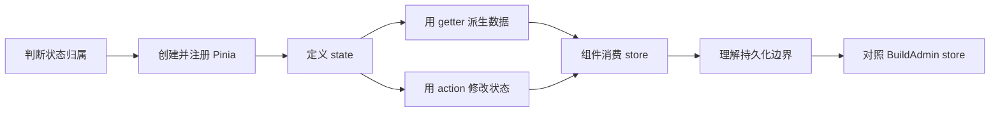

# 第 11 节：Pinia 状态管理

## 1. 课程信息

| 项目 | 内容 |
| --- | --- |
| 节次 | 第 11 节 |
| 课程主题 | Pinia 状态管理 |
| 当前状态 | 🟩 已完成 |
| 建议时长 | 2～3 小时 |
| 源码观察对象 | `buildadmin/web/src/stores/index.ts`、`adminInfo.ts`、`config.ts`、`siteConfig.ts` |
| 本节实践目录 | `E:\Project\MyProject\ba-learn` |
| 本节产物 | 用户 store、应用配置 store，以及消费全局状态的后台页面 |

## 2. 本节目标

完成本节后，你应当能够：

1. 判断一份状态应放在组件内、父组件中还是 Pinia store 中。
2. 解释 Pinia 的 store、state、getters、actions 各自负责什么。
3. 使用组合式写法定义带类型的用户 store 和应用配置 store。
4. 在不同组件中读取及修改同一个 store，并理解它们为何能够同步。
5. 正确使用 `storeToRefs()` 解构响应式状态。
6. 理解持久化与内存状态的区别，以及哪些数据不宜盲目持久化。
7. 读懂 BuildAdmin 中 `adminInfo`、`config`、`siteConfig` store 的主要职责。

## 3. 开课诊断

先不要查教材，请在聊天中按自己的理解回答。答错没有关系，Coach 会据此调整讲解深度：

1. 登录后的用户名需要同时显示在顶部栏和个人资料页。你会把用户名放在哪里？为什么？
2. 如果直接写 `const { nickname } = userStore`，之后 store 中的昵称变化，`nickname` 一定会跟着更新吗？
3. 你认为 getter 和 action 分别更像 Vue 中的什么？
4. 页面刷新后 Pinia 中的数据默认还在吗？为什么？

## 4. 学习路线

今天按以下顺序逐步推进：

1. 完成开课诊断。
2. 学习“状态应该放在哪里”以及 Pinia 的四个核心概念。
3. 对照 BuildAdmin 的 Pinia 注册与三个真实 store。
4. 创建用户 store，并在后台页面显示和修改用户信息。
5. 创建应用配置 store，实现侧边栏折叠状态。
6. 由 Coach 执行类型检查、构建和代码检查。
7. 通过自然问答完成本节核心验收。

## 5. Coach 引导与学生回答

### 引导一：Pinia 解决的不是“所有状态”，而是共享状态

输入框是否聚焦、弹窗是否正在播放入场动画，这类只服务于一个组件的状态通常留在组件内。当前用户、主题偏好、侧边栏是否折叠等需要跨组件或跨页面使用的数据，更适合放入 store。

判断时先问两件事：谁需要它，以及它需要活多久。不要因为 Pinia 已安装，就把每一个 `ref()` 都搬进 store。

### 引导二：四个核心角色

- store：有唯一名称的全局状态仓库。
- state：仓库保存的源数据。
- getters：根据 state 计算出的派生数据，接近 `computed`。
- actions：表达业务动作的方法，可以同步或异步，并负责修改状态。

### 引导三：本节对应的 BuildAdmin 源码

- `stores/index.ts` 创建 Pinia，并安装持久化插件。
- `stores/adminInfo.ts` 保存管理员资料、token，并通过 actions 集中修改。
- `stores/config.ts` 保存布局、语言和 CRUD 偏好，采用组合式 store。
- `stores/siteConfig.ts` 保存站点名称、接口地址和初始化标记。

BuildAdmin 没有把所有数据塞进一个巨大 store，而是按业务职责拆分。我们的练习也会拆成 `user` 和 `app` 两个 store。

### 开课诊断回答与反馈

1. 学生回答：放在 Pinia，因为 Pinia 是全局状态，可以被所有组件共享。
   Coach 反馈：判断正确。用户名会被后台布局和个人资料页等不相邻组件共同使用，适合放进用户 store。需要补充的是，Pinia 用来管理适合共享的状态，并不意味着所有组件状态都应全局化；只服务于单个组件的临时状态仍应留在组件内部。
2. 学生回答：不会，因为解构会失去响应性。
   Coach 反馈：正确。普通解构取得的是当前属性值，不会继续追踪 store 属性；需要解构 state 或 getter 时，应使用 `storeToRefs(userStore)`。action 是方法，可以直接解构或通过 store 调用。
3. 学生回答：不知道。
   Coach 反馈：这是本节需要建立的新概念。getter 接近 Vue 的 `computed`，负责根据现有 state 计算派生数据；action 接近组件中表达业务操作的函数，负责修改状态，也可以执行异步流程。
4. 学生回答：还在，因为保存在内存里。
   Coach 反馈：需要修正。Pinia 默认状态确实位于内存，但刷新会销毁当前页面的 JavaScript 运行环境；新页面重新创建 store 后会恢复初始值。若希望刷新后恢复，需要额外同步到 `localStorage`、`sessionStorage`，或使用持久化插件并设计恢复范围。

### getter 与 action 课堂检查

问题：已经保存 `sidebarCollapsed` 时，侧边栏宽度应放在 state 还是 getter？

学生回答：放在 getter，因为它依赖 `sidebarCollapsed` 状态。

Coach 反馈：正确。`sidebarCollapsed` 是源状态，宽度是可以由它稳定计算出的派生结果。使用 getter 能避免同时维护折叠状态和宽度而产生不一致。

### 内存状态课堂检查

问题：未使用任何持久化方案，把昵称从“Hunter”改成“小明”后刷新，昵称会变成什么？

学生回答：小明。

Coach 反馈：需要继续修正。刷新会销毁保存“小明”的旧内存，新页面重新执行 store 定义，因此昵称恢复为代码中的初始值；若初始昵称为空字符串，刷新后就是空字符串。只有重新请求数据或从持久化存储恢复，才可能再次得到“小明”。

追问回答：Pinia 默认把状态保存在当前页面的 JavaScript 内存中；刷新会销毁它，因此 store 恢复初始值。

Coach 反馈：正确，已修正此前对内存状态生命周期的误解。

## 6. 动手任务（明确目录和文件名）

本节代码均在 `E:\Project\MyProject\ba-learn` 中完成。请等 Coach 按课堂进度布置具体一步后再写，不需要现在一次性完成。

### 任务一：整理 Pinia 入口

修改：`src/main.ts`

- 把 `createPinia()` 的结果保存为 `pinia` 变量。
- 使用 `app.use(pinia)` 注册。
- 本节先理解浏览器内存状态；持久化插件作为概念学习，不强制安装新依赖。

### 任务二：创建用户 store

新建：`src/stores/user.ts`

- 定义用户身份所需的最小状态，例如 `id`、`username`、`nickname`、`token`。
- 提供一个派生显示名称。
- 提供写入用户信息、修改昵称和清空用户状态的 actions。
- 不在组件中散落对多个用户字段的重复赋值逻辑。

### 任务三：创建应用配置 store

新建：`src/stores/app.ts`

- 保存侧边栏折叠状态。
- 提供切换和显式设置折叠状态的 actions。
- 提供可供模板直接显示的派生文本或宽度。

### 任务四：在两个位置消费共享状态

修改：`src/layouts/AdminLayout.vue`

- 顶部显示用户昵称。
- 增加侧边栏折叠按钮。
- 根据 app store 的状态改变侧边栏表现。

修改：`src/views/home/HomeView.vue`

- 显示同一个用户 store 中的用户信息。
- 提供一个明确操作来修改昵称或模拟填充用户。
- 修改后，布局顶部应同步变化，以证明两个组件消费的是同一仓库。

### 任务五：Coach 验证

Coach 将检查：

1. 两个组件是否共享同一份用户状态。
2. 是否使用 action 表达业务修改。
3. 解构 store 时是否保留响应性。
4. 本地状态与全局状态的边界是否合理。
5. `npm run type-check` 与 `npm run build` 是否通过。

完成代码后告诉 Coach“第 11 节代码已完成”，Coach 会直接检查文件和执行机械验证。

## 7. 本节输出

本节不要求固定字数、表格或流程图。验收依据是实际代码、运行结果、排错过程和自然问答，重点考察：

- 能判断状态是否应该进入 Pinia。
- 能解释 state、getters、actions 的职责。
- 能实现两个组件共享及同步更新状态。
- 能解释刷新后状态为何丢失，以及持久化解决了哪一层问题。

## 8. 验收标准

| 检查项 | 通过条件 |
| --- | --- |
| 状态边界 | 能区分组件局部状态与跨组件共享状态 |
| 用户 store | 用户源数据、派生名称和修改动作职责清楚 |
| 配置 store | 侧边栏折叠状态可读、可切换 |
| 响应性 | 组件读取 store 后能随状态更新而刷新 |
| 组件联动 | 首页修改用户状态，布局顶部同步更新 |
| 持久化理解 | 能区分 Pinia 内存状态与浏览器持久化存储 |
| 工程检查 | TypeScript 类型检查和生产构建通过 |
| 源码理解 | 能说清 BuildAdmin 为什么拆分多个 store |

## 9. 学习小结

本节从“谁需要状态、状态要活多久”出发，建立了组件局部状态与 Pinia 共享状态的边界。学生完成了用户 store 和应用配置 store：使用 `ref` 保存源状态，使用 `computed` 表达显示名称、侧边栏宽度和操作文字，使用 actions 集中处理填充、修改、清空与切换操作。

实践中，`AdminLayout.vue` 和 `HomeView.vue` 取得同一个用户 store，实现了跨组件同步；布局通过 app store 驱动侧边栏宽度与按钮文字。学生掌握了 `storeToRefs()` 的使用原因，并修正了“内存状态刷新后仍保留”的误区，能够区分 Pinia 状态管理与额外持久化。

对照 BuildAdmin 源码后，学生能够说明 `adminInfo`、`config`、`siteConfig` 等 store 按业务职责拆分的解耦价值。类型检查与生产构建均通过。

## 10. 进度更新

| 项目 | 当前记录 |
| --- | --- |
| 开始日期 | 2026-08-29 |
| 当前状态 | 🟩 已完成 |
| 已完成步骤 | 开课诊断、概念学习、源码对照、两个 store 实践、跨组件联动、工程检查、核心验收 |
| 待完成步骤 | 无 |
| 下一动作 | 开始第 12 节：后台整体布局 |

### 开课诊断完成记录

- 学生能够判断跨组件用户信息适合放进 Pinia。
- 学生理解普通解构会使 state 失去响应式连接。
- 经讲解与检查，学生已建立 getter 类似 `computed`、action 表达业务动作的基本认识。
- 学生起初误认为内存状态刷新后保留，经两次追问后已明确：刷新销毁旧 JavaScript 内存，store 恢复初始值。

### 动手任务一检查记录

学生已修改 `src/main.ts`，将 `createPinia()` 的结果保存为 `pinia` 变量，并通过 `app.use(pinia)` 注册。磁盘文件检查通过。此调整与原写法功能等价，但为后续安装插件或在组件外显式使用实例提供了清晰入口。

### 动手任务二阶段检查记录

学生已创建 `src/stores/user.ts`，组合式 store ID 为 `user`，并定义、返回了 `id`、`username`、`nickname`、`token` 四项源状态。初次导出名写为 `userStore`；Coach 指出 `defineStore()` 返回的是用于取得 store 实例的函数，而不是实例本身，因此应命名为 `useUserStore`，组件中再通过 `const userStore = useUserStore()` 创建或取得实例。

学生随后添加 `displayName` getter。阶段检查发现：导出名误写为 `userUserStore`；条件中使用了 ref 对象而非 `.value`；用户名与昵称的降级顺序和需求相反。Coach 说明 ref 对象本身始终是真值，组合式 store 的函数代码中必须通过 `.value` 读取其内容，并要求按“昵称 → 用户名 → 未登录”的顺序修正。

学生已完成修正：导出名称为 `useUserStore`；`displayName` 使用 `.value` 读取 state；降级顺序为“昵称 → 用户名 → 未登录”。getter 阶段检查通过。

学生已添加并返回 `updateNickname(value)` action，其中使用 `value.trim()` 统一清除昵称首尾空格。课堂检查中学生确认传入 `'  小明  '` 后，store 最终保存 `'小明'`。代码检查通过。

学生已定义 `UserProfile` 接口，并实现、返回 `setUser(profile)` action。该 action 使用 `.value` 将 `id`、`username`、`nickname`、`token` 四项资料一次写入 store，类型和赋值关系检查通过。

学生已实现并返回 `clearUser()`，将四项用户 state 全部恢复为定义时的初始值。用户 store 已具备源状态、派生显示名称，以及修改昵称、完整填充和清空用户三个业务 actions；当前阶段检查通过。

学生已在 `src/layouts/AdminLayout.vue` 调用 `useUserStore()`，并通过 `storeToRefs(userStore)` 解构 `displayName`，在布局顶部显示当前用户。getter 的响应式消费方式检查通过，待从首页修改同一 store 验证跨组件联动。

学生已在 `src/views/home/HomeView.vue` 取得同一个用户 store，并通过“模拟填充用户”“修改昵称”“清空用户”三个按钮调用 `setUser()`、`updateNickname()` 和 `clearUser()`；原用户详情导航保留。布局与首页由同一 store ID 共享状态，跨组件联动代码检查通过。`npm.cmd run type-check` 已通过。模拟填充使用小写昵称 `hunter`，因此实际初次显示与教材示例的 `Hunter` 大小写不同，但不影响状态机制。

### 动手任务三阶段检查记录

学生已创建 `src/stores/app.ts`，能正确区分 `sidebarCollapsed` state、宽度与按钮文字 getters、切换与显式设置 actions。初次实现存在三处问题：导出函数命名为 `userAppStore`；按钮文字 getter 判断了 ref 对象而非 `.value`；`toggleSidebar()` 只计算 `!sidebarCollapsed.value` 而没有赋值回 state。Coach 要求修正，并说明表达式产生新布尔值不会自动修改原 ref。

学生已完成三处修正：导出名为 `useAppStore`；两个 getters 均读取 `sidebarCollapsed.value`；`toggleSidebar()` 将反值赋回 state。`setSidebarCollapsed(value)` 也能显式设置状态。app store 代码检查通过。

学生已将 app store 接入 `AdminLayout.vue`：通过 `storeToRefs()` 读取宽度与按钮文字，按钮调用 `toggleSidebar()`，侧边栏使用动态行内宽度，主内容区改用 `flex: 1`，并添加宽度过渡。`npm.cmd run type-check` 通过。

学生提问：`flex: 1` 的作用是什么？

Coach 讲解：当前父元素 `.container` 是横向 flex 容器，侧边栏占据 getter 给定的固定宽度，`.main { flex: 1 }` 会让主内容区伸展并占用主轴上的剩余空间。它常见地可理解为 `flex-grow: 1; flex-shrink: 1; flex-basis: 0%`；父元素不是 flex/grid 容器时不会产生这里的剩余空间分配效果。

课堂检查：当容器宽度为 `1200px`、侧边栏宽度为 `220px` 时，学生回答主内容区宽度为 `1200 - 220`，即约 `980px`。理解正确。

### 工程检查记录

- `npm.cmd run type-check`：通过。
- `npm.cmd run build`：通过，Vite 成功转换 1608 个模块并生成生产产物。
- 构建提示主入口 chunk 超过 500 kB，这是当前 Element Plus 等依赖打包形成的性能提示，不影响本节 Pinia 功能与验收。
- 待完成：核心理解验收与课程总结。

### 核心验收问答

1. 问题：为什么 `nickname`、`sidebarCollapsed` 适合成为 state，而 `displayName`、`sidebarWidth` 更适合成为 getter？
   学生回答：前者是固定属性，后者是依赖状态的派生值。
   Coach 反馈：核心判断正确，“依赖状态的派生值”表述准确；“固定属性”应修正为“源状态”。源状态也会变化，但它来自用户操作、接口或业务动作，不能由其他现有 state 完整计算；getter 则可以从源状态稳定推导，避免重复保存和状态不一致。
2. 问题：为什么把“清空用户”写成 `clearUser()` action，而不是让每个组件分别清空四个字段？
   学生回答：为了封装和复用。
   Coach 反馈：正确。action 还集中维护了“清空用户”的完整业务规则；以后用户模型增加字段，只需修改一个 action，可以避免不同组件清理不完整。
3. 问题：为什么解构 `displayName` 时使用 `storeToRefs(userStore)`？
   学生回答：普通解构会失去响应性，使用 `storeToRefs` 可以保持响应性。
   Coach 反馈：正确。`storeToRefs()` 让解构出的 state/getter 仍与原 store 保持响应式连接，因此 action 更新后模板会继续刷新。
4. 问题：当前项目未配置持久化，填充用户后刷新会怎样；若要恢复需要什么？
   学生回答：恢复默认值；需要持久化。
   Coach 反馈：正确，已修正开课诊断中的误区。刷新会重建运行环境并让 store 恢复初始值；若要恢复，需要把选定状态同步到浏览器存储并在启动时还原，或配置持久化插件。持久化并非 Pinia 默认行为。
5. 问题：BuildAdmin 为什么把管理员信息、布局配置、站点配置和标签页拆成多个 store？
   学生回答：为了解耦，不同业务使用不同的 store。
   Coach 反馈：正确。按业务职责拆分能保持每个 store 内聚，组件只依赖所需仓库，降低修改影响范围并提高可读性和可维护性。

### 最终验收记录（2026-08-29）

- 用户 store 与应用配置 store 均已完成。
- state、getters、actions 的职责划分通过验收。
- 首页与后台布局共享同一用户状态，修改后可响应式联动。
- `storeToRefs()` 的使用原因通过验收。
- 已明确 Pinia 默认内存状态刷新后恢复初始值，持久化需要额外方案。
- 能解释 BuildAdmin 按业务职责拆分多个 store 的原因。
- `npm.cmd run type-check` 与 `npm.cmd run build` 均通过。

Coach 结论：第 11 节核心目标全部达成，状态更新为 🟩 已完成。
